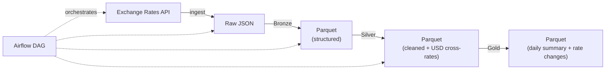

# Exchange Rates Pipeline

## Overview

This pipeline ingests foreign exchange rate data from the **[Exchange Rates API](https://exchangeratesapi.io/)** (free tier) and processes it through a **medallion architecture** (Bronze → Silver → Gold).



## Free-Tier Limitations

| Feature | Free Plan |
|---------|-----------|
| Base currency | **EUR only** |
| Update frequency | Every 60 min |
| Monthly requests | **250** |
| Historical data | ✅ |
| SSL | ✅ |
| `base` parameter | ❌ |

> USD cross-rates are computed in the Silver layer by dividing each EUR rate by the EUR→USD rate.

## Setup

### 1. Get an API Key
Sign up at [exchangeratesapi.io](https://manage.exchangeratesapi.io/) → copy your free API key.

### 2. Configure `.env`
```env
EXCHANGE_RATES_API_KEY=<your-key>
EXCHANGE_RATES_BASE_URL=https://api.exchangeratesapi.io/v1
DATA_DIR=data
```

### 3. Install dependencies
```bash
pip install -r requirements.txt
```

## Running Manually

```bash
# Ingest latest rates
python -m ingestion.exchange_rates

# Run each Spark layer individually
python -m spark_jobs.bronze.exchange_rates_bronze
python -m spark_jobs.silver.exchange_rates_silver
python -m spark_jobs.gold.exchange_rates_gold
```

## Data Layers

| Layer | Path | Description |
|-------|------|-------------|
| **Raw** | `data/raw/exchange_rates/` | Unmodified API JSON responses |
| **Bronze** | `data/bronze/exchange_rates/` | Structured Parquet (one row per currency) |
| **Silver** | `data/silver/exchange_rates/` | Cleaned, deduplicated, with USD cross-rates |
| **Gold** | `data/gold/exchange_rates/` | Daily summary + day-over-day % changes |

## Airflow DAG

- **DAG ID:** `exchange_rates_pipeline`
- **Schedule:** `@daily`
- **Tasks:** `ingest_rates → bronze_transform → silver_transform → gold_aggregate`

## Running Tests

```bash
python -m pytest tests/unit/test_exchange_rates.py -v
```
All tests use mocked API responses — no API key required.
